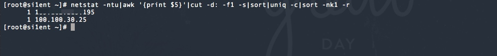
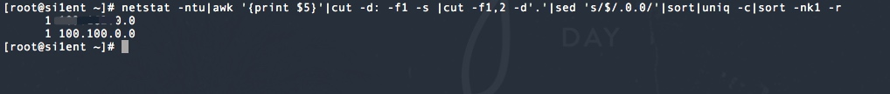
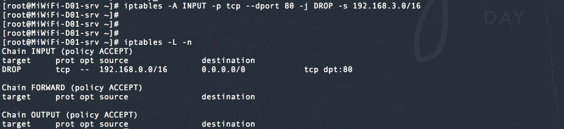
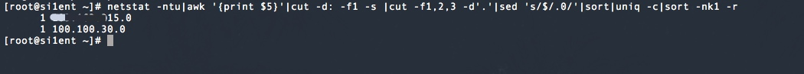
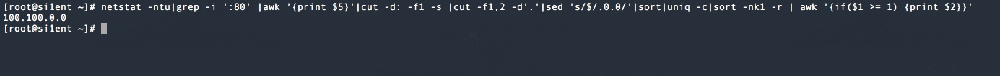

# netstat

```
Author:si1ent
Date:5/14
```
# 介绍

# DDoS中常用命令
## 统计当前连接IP数量
```
如需针对某个端口的统计在netstat之后进行grep来过过滤
netstat -ntu | grep -i ":80" | .....
```
```
netstat -ntu|awk '{print $5}'|cut -d: -f1 -s|sort|uniq -c|sort -nk1 -r
```


## 统计以/16 (xxx.xxx.0.0)显示
```
netstat -ntu|awk '{print $5}'|cut -d: -f1 -s |cut -f1,2 -d'.'|sed 's/$/.0.0/'|sort|uniq -c|sort -nk1 -r
```


## iptables添加指定端口进行封堵
通过以上获取/16网段并通过iptables进行添加，不允许访问到80服务。
！！！！！注意：
在执行iptables前需确定IP地址的归属地，不然导致部分IP无法访问.

```
iptables -A INPUT -p tcp --dport 80 -j DROP -s 192.168.3.0/16
```


## 统计以/24 (xxx.xxx.xxx.0) 显示
```
netstat -ntu|awk '{print $5}'|cut -d: -f1 -s |cut -f1,2,3 -d'.'|sed 's/$/.0/'|sort|uniq -c|sort -nk1 -r
```



## 只统计80端口实时信息
```
netstat -ntu|grep -i ':80' |awk '{print $5}'|cut -d: -f1 -s |cut -f1,2 -d'.'|sed 's/$/.0.0/'|sort|uniq -c|sort -nk1 -r | awk '{if($1 >= 1) {print $2}}'
```
```
统计数量修改获取，iptables可直接按照上面来进行添加。
```


## 查找较多time_wait连接

```
netstat -n|grep "TIME_WAIT"|awk '{print $5}' |sort|uniq -c|sort -rn|head -n20
```

## 查找较多的SYN连接

```
netstat -an | grep "SYN" | awk '{print $5}'' | awk -F： '{print $1}' | sort | uniq -c | sort -nr | more
```

## 封单IP

```
iptables -I INPUT -s 211.1.0.0 -j DROP
```

## 封IP段的命令

```
iptables -I INPUT -s 211.1.0.0/16 -j DROP　
iptables -I INPUT -s 211.2.0.0/16 -j DROP
iptables -I INPUT -s 211.3.0.0/16 -j DROP
```

## 封整个段

```
iptables -I INPUT -s 211.0.0.0/8 -j DROP
```

## 封几个段的命令

```
iptables -I INPUT -s 61.37.80.0/24 -j DROP
iptables -I INPUT -s 61.37.81.0/24 -j DROP
```

